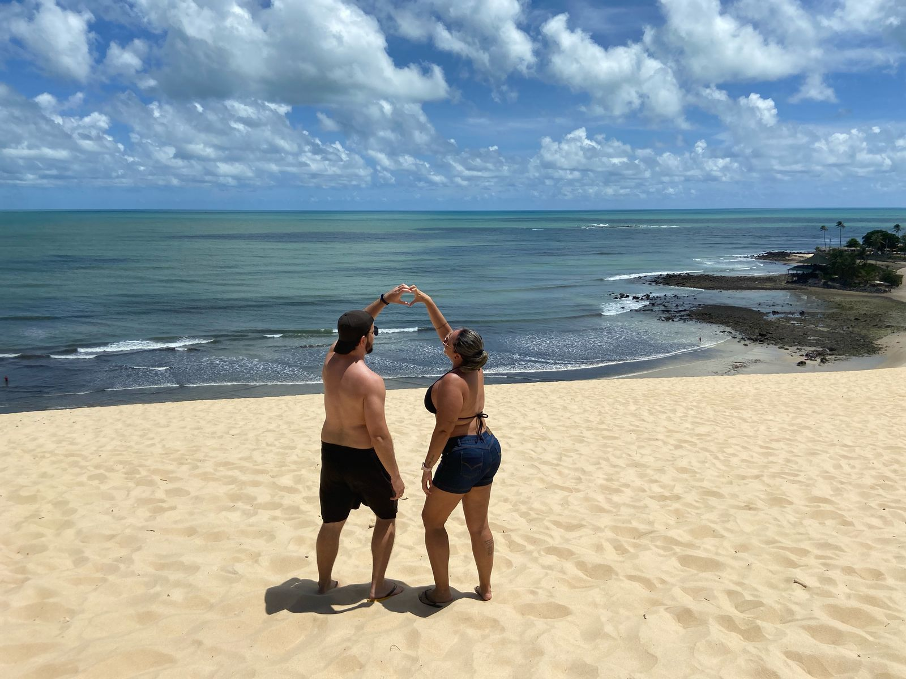

# Convite de Casamento Digital - Andréia & Willian



Um elegante site de convite de casamento, desenvolvido com React, estilizado com Styled Components e com funcionalidades como galeria de fotos, contagem regressiva, informações do evento e mapa da localização.

## 📋 Visão Geral

Este projeto consiste em um site de convite de casamento digital, com uma interface elegante e responsiva, adaptada para visualização em dispositivos móveis e desktop. O convite inclui:

- Seção Hero com detalhes do casal e data
- Contagem regressiva para o grande dia
- Informações sobre cerimônia e recepção
- Galeria de fotos do casal
- Mapa interativo com localização do evento
- Informações sobre presentes e lista de casamento

## 🚀 Tecnologias Utilizadas

- React.js
- Styled Components
- React Router DOM
- React Leaflet (para mapas)
- React Icons

## 💻 Instalação e Uso

Para executar este projeto localmente:

```bash
# Clone o repositório
git clone https://github.com/seu-usuario/convite-casamento.git

# Entre no diretório
cd convite-casamento

# Instale as dependências
npm install

# Execute o servidor de desenvolvimento
npm start
```

Para gerar uma versão de produção:

```bash
npm run build
```

## 🔧 Estrutura do Projeto

```
/src
  /assets        # Imagens, fontes e arquivos estáticos
  /components    # Componentes React reutilizáveis
  /styles        # Estilos globais e temas
  App.js         # Componente principal
  index.js       # Ponto de entrada do React
```

## ✨ Funcionalidades

### Galeria de Fotos
Exibe fotos do casal com um visualizador de imagens em modal.

### Contagem Regressiva
Contador dinâmico mostrando dias, horas, minutos e segundos até a data do casamento.

### Mapa Interativo
Implementado com React Leaflet, mostra a localização exata do evento.

### Layout Responsivo
Design adaptado para qualquer tamanho de tela, desde dispositivos móveis até desktops.

## 🎨 Personalização

Para personalizar este projeto:

1. **Imagens**: Substitua as imagens na pasta `/src/assets`
2. **Cores**: Modifique as variáveis CSS em `/src/index.css`
3. **Textos**: Atualize textos e informações diretamente nos componentes
4. **Data do evento**: Altere a data no componente de contagem regressiva

## 📝 Como implantar

O site pode ser facilmente implantado usando:

- [Netlify](https://netlify.com)
- [Vercel](https://vercel.com)
- [GitHub Pages](https://pages.github.com)

## 📄 Licença

Este projeto está sob a licença MIT. Consulte o arquivo LICENSE para obter mais detalhes.

---

Desenvolvido com 💖 por Willian para Andréia | 2025
